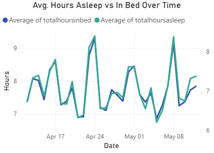
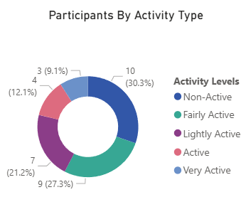
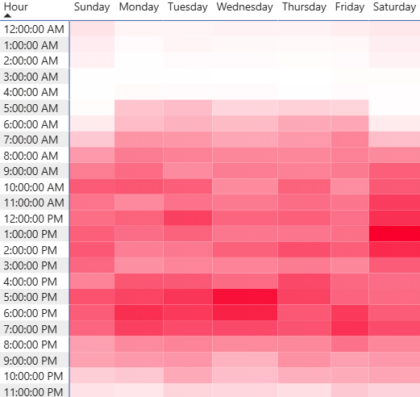
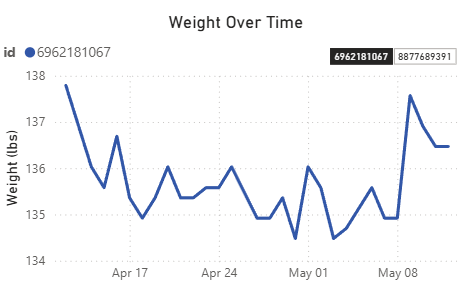

# Bellabeat Data Analysis Portfolio

## 1. Background and Overview

Bellabeat, established in 2014, is a high-tech company that manufactures wellness-focused smart devices tailored for women. With a growing product line, including the Leaf tracker, the Time watch, and the Spring hydration bottle, Bellabeat aims to enhance women’s health through technology.

As a junior data analyst on the Bellabeat marketing team, I was tasked with analyzing smart device usage data. The goal was to uncover user behaviour patterns and recommend a data-informed marketing strategy to support growth in an increasingly competitive wellness tech market.

Insights and recommendations are provided on the following key areas:

- **Product App/Feature Usage**: Evaluation of the proportion of total users who used certain features, such as weight tracking or sleep tracking.
- **User Physical Activity Analysis**: An assessment of user physical activity, based on Daily Steps and Metabolic Equivalent of Tasks (METs), to understand their overall fitness level.
- **User Sleep & Weight Patterns Analysis**: An analysis of users' sleep behaviours and weight over time.

---

## 2. Data Structure & Initial Checks

The Bellabeat dataset is composed of user-generated smart device data across three main areas: activity tracking, sleep behavior, and weight logging. This structured data was merged, cleaned, and transformed into multiple tables to support detailed analysis of user engagement patterns.

The final structure includes both raw merged tables and cleaned analytical tables, as shown below:

<table>
<tr>
<td valign="top" width="50%">

### weightLogInfo_merged

| Column Name      | Data Type |
|------------------|-----------|
| Id               | int64     |
| Date             | date      |
| WeightKg         | float64   |
| WeightPounds     | float64   |
| Fat              | float64   |
| BMI              | float64   |
| IsManualReport   | bool      |
| LogId            | int64     |

</td>
<td valign="top" width="50%">

### sleepDay_merged

| Column Name         | Data Type |
|---------------------|-----------|
| Id                  | int64     |
| SleepDay            | date      |
| TotalSleepRecords   | int64     |
| TotalMinutesAsleep  | int64     |
| TotalTimeInBed      | int64     |

</td>
</tr>

<tr>
<td valign="top">

### dailyActivity_merged

| Column Name               | Data Type |
|---------------------------|-----------|
| Id                        | int64     |
| ActivityDate              | date      |
| TotalSteps                | int64     |
| TotalDistance             | float64   |
| TrackerDistance           | float64   |
| LoggedActivitiesDistance  | float64   |
| VeryActiveDistance        | float64   |
| ModeratelyActiveDistance  | float64   |
| LightActiveDistance       | float64   |
| SedentaryActiveDistance   | float64   |
| VeryActiveMinutes         | int64     |
| FairlyActiveMinutes       | int64     |
| LightlyActiveMinutes      | int64     |
| SedentaryMinutes          | int64     |
| Calories                  | int64     |

</td>
<td valign="top">

### weight_over_time

| Column Name     | Data Type |
|-----------------|-----------|
| Id              | int64     |
| logdate         | date      |
| weightpounds    | float64   |
| bmi             | float64   |

 

### sleep_over_time

| Column Name        | Data Type |
|--------------------|-----------|
| id                 | int64     |
| sleepday           | date      |
| totalhoursasleep   | float64   |
| totalhoursinbed    | float64   |

</td>
</tr>

<tr>
<td valign="top">

### kpi_2_avg_sleep_per_Id

| Column Name | Data Type |
|-------------|-----------|
| Id          | int64     |
| avg_sleep   | float64   |

</td>
<td valign="top">

### categorized_user_activity

| Column Name     | Data Type |
|-----------------|-----------|
| activity_type   | string    |
| total           | int64     |
| user_percentage | float64   |

</td>
</tr>
</table>

---

## 3. Executive Summary – Overview of Findings

The data presents insights into user behaviour across weight tracking, sleep logging, and physical activity. Out of 33 total users, only 24 logged their sleep and just 8 logged their weight. The logging activity indicates low to upper mid levels of engagement in health tracking habits that could affect the accuracy of trend forecasting and personalized health interventions.

Below is the overview page from the PowerBI dashboard and more examples are included throughout the report. The entire interactive dashboard can be downloaded [here](./Bellabeat.pbix).

---

## 4. Insights Deep Dive

### Sleep Behaviour

Bellabeat users averaged **6.29 hours of sleep per night**, but data shows they typically spent **1–2 hours awake while in bed**. This points to potentially low sleep efficiency, which may stem from stress, poor bedtime routines, or extended screen exposure.

- **Average total time in bed exceeds time asleep by up to 2 hours.**
- Indicates potential for health risk related to poor sleep hygiene.
- **Recommendation:** Introduce guided breathing, wind-down reminders, and screen-time detox features.

*Figure 1: Average hours asleep vs. in bed over time.*

---

### Activity Patterns

Approximately **70% of users log daily physical activity**, and **30% are categorized as “Very Active”**, showing high baseline engagement and a strong product-market fit for Bellabeat's fitness features.

- User activity shows consistency across days.
- **Opportunity exists to expand through personalized fitness plans and gamified goals.**
- **Recommendation:** Offer adaptive fitness programs, milestone badges, and community challenges.

*Figure 2: Distribution of user activity types.*

---

### METs Analysis

Analysis of **Metabolic Equivalent of Tasks (METs)** revealed that users are most physically active during the **evening on weekdays (5–7 PM)**, and **early afternoon on weekends**, especially Saturdays.

- Sunday is consistently the **least active day**.
- Weekday evening METs suggest users are active after work.
- **Recommendation:** Schedule push notifications, reminders, or activity nudges aligned with high MET periods.

*Figure 3: Average METs by hour and day of the week.*

---

### Weight Tracking

Out of 33 users, only **8 logged weight**—representing a participation rate of **~24%**. While the feature is underutilized, the logged data shows **stable trends** with fluctuations of only 2–4 lbs over several weeks.

- Users may view weight logging as optional or less valuable.
- Logs show consistency, indicating possible maintenance mindset.
- **Recommendation:** Reframe weight logging as a trend-awareness feature and add streak badges or passive sync options via smart scales.

*Figure 4: Weight trends across logged users.*

---

## 5. Recommendations

Based on user engagement trends and behavioral analysis, the following actions are recommended to enhance Bellabeat’s product impact and user retention:

- **Introduce sleep improvement features** such as bedtime wind-down routines, screen-time detox challenges, and guided breathing sessions. With the average user sleeping 6.29 hours and spending 1–2 hours awake in bed, helping users build efficient sleep habits could significantly improve satisfaction and app usage.

- **Gamify weight logging through trends and streaks.** Only 24% of users track weight, indicating low engagement with this feature. By reframing weight logs as a trend-monitoring tool rather than a goal, and rewarding consistent logging with badges, Bellabeat can increase usage frequency without triggering performance anxiety.

- **Personalize activity engagement with adaptive programs and streak-based nudges.** With 70% of users classified as active and peak METs activity in the 5–7 PM window, Bellabeat should deliver dynamic content (like post-work challenges, hydration reminders, or journal prompts) timed to match user patterns.

- **Expand messaging campaigns with A/B-tested delivery times** to optimize behavioral influence. Test hydration and mindfulness reminders sent during morning and evening peaks to drive higher user response rates.

- **Develop healthy lifestyle integrations through recipes and smart device partnerships.** Offering easy, healthy meals via curated “Bellabeat recipes” or collaborating with smart scale/wearable brands can deepen user ecosystem value.

- **Explore segmentation by adding demographic data** to future datasets. Understanding if users are early-career women, midlife professionals, or new moms would allow for micro-targeted feature rollouts and product positioning.
