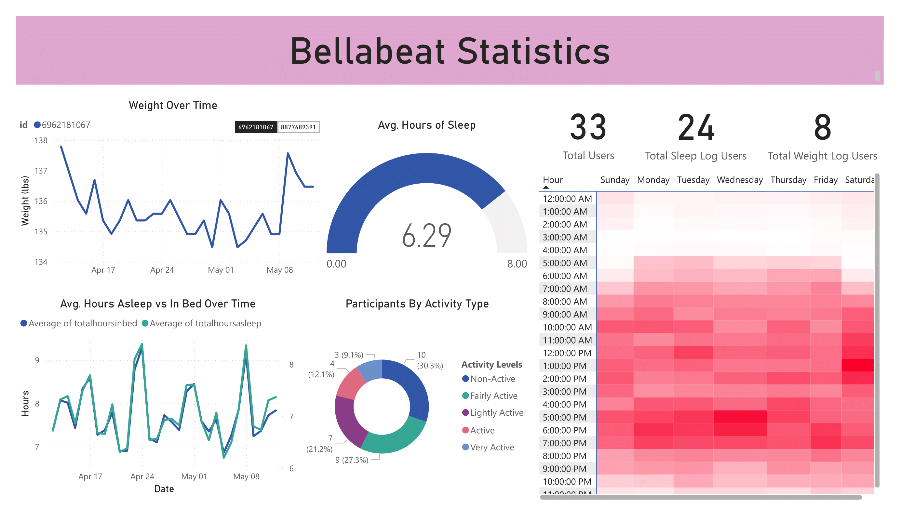

# Bellabeat Data Analysis Portfolio

## 1. Background and Overview

Bellabeat, established in 2014, is a high-tech company that manufactures wellness-focused smart devices tailored for women. With a growing product line, including the Leaf tracker, the Time watch, and the Spring hydration bottle, Bellabeat aims to enhance women’s health through technology.

As a junior data analyst on the Bellabeat marketing team, I was tasked with analyzing smart device usage data. The goal was to uncover user behaviour patterns and recommend a data-informed marketing strategy to support growth in an increasingly competitive wellness tech market.

Insights and recommendations are provided on the following key areas:

- **Product App/Feature Usage**: Evaluation of the proportion of total users who used certain features, such as weight tracking or sleep tracking.
- **User Physical Activity Analysis**: An assessment of user physical activity, based on Daily Steps and Metabolic Equivalent of Tasks (METs), to understand their overall fitness level.
- **User Sleep & Weight Patterns Analysis**: An analysis of users' sleep behaviours and weight over time.

---

## 2. Data Structure & Initial Checks

The Bellabeat dataset is composed of user-generated smart device data across three main areas: activity tracking, sleep behavior, and weight logging. This structured data was merged, cleaned, and transformed into multiple tables to support detailed analysis of user engagement patterns.

The final structure includes both raw merged tables and cleaned analytical tables, as shown below:

<table>
<tr>
<td valign="top" width="50%">

### weightLogInfo_merged

| Column Name      | Data Type |
|------------------|-----------|
| Id               | int64     |
| Date             | date      |
| WeightKg         | float64   |
| WeightPounds     | float64   |
| Fat              | float64   |
| BMI              | float64   |
| IsManualReport   | bool      |
| LogId            | int64     |

</td>
<td valign="top" width="50%">

### sleepDay_merged

| Column Name         | Data Type |
|---------------------|-----------|
| Id                  | int64     |
| SleepDay            | date      |
| TotalSleepRecords   | int64     |
| TotalMinutesAsleep  | int64     |
| TotalTimeInBed      | int64     |

</td>
</tr>

<tr>
<td valign="top">

### dailyActivity_merged

| Column Name               | Data Type |
|---------------------------|-----------|
| Id                        | int64     |
| ActivityDate              | date      |
| TotalSteps                | int64     |
| TotalDistance             | float64   |
| TrackerDistance           | float64   |
| LoggedActivitiesDistance  | float64   |
| VeryActiveDistance        | float64   |
| ModeratelyActiveDistance  | float64   |
| LightActiveDistance       | float64   |
| SedentaryActiveDistance   | float64   |
| VeryActiveMinutes         | int64     |
| FairlyActiveMinutes       | int64     |
| LightlyActiveMinutes      | int64     |
| SedentaryMinutes          | int64     |
| Calories                  | int64     |

</td>
<td valign="top">

### weight_over_time

| Column Name     | Data Type |
|-----------------|-----------|
| Id              | int64     |
| logdate         | date      |
| weightpounds    | float64   |
| bmi             | float64   |

 

### sleep_over_time

| Column Name        | Data Type |
|--------------------|-----------|
| id                 | int64     |
| sleepday           | date      |
| totalhoursasleep   | float64   |
| totalhoursinbed    | float64   |

</td>
</tr>

<tr>
<td valign="top">

### kpi_2_avg_sleep_per_Id

| Column Name | Data Type |
|-------------|-----------|
| Id          | int64     |
| avg_sleep   | float64   |

</td>
<td valign="top">

### categorized_user_activity

| Column Name     | Data Type |
|-----------------|-----------|
| activity_type   | string    |
| total           | int64     |
| user_percentage | float64   |

</td>
</tr>
</table>

---

## 3. Executive Summary – Overview of Findings

The data presents insights into user behaviour across weight tracking, sleep logging, and physical activity. Out of 33 total users, only 24 logged their sleep and just 8 logged their weight. The logging activity indicates low to upper mid levels of engagement in health tracking habits that could affect the accuracy of trend forecasting and personalized health interventions.

Below is the overview page from the PowerBI dashboard and more examples are included throughout the report. The entire interactive dashboard can be downloaded [here](./Bellabeat.pbix).

---

## 4. Insights Deep Dive

### Sleep Behaviour
- Average of 6.29 hours asleep per night.
- Users spend 1–2 hours awake while in bed.
- Indicates poor sleep efficiency potentially due to stress, screen time, or irregular routines.
- Suggestions: app features like wind-down reminders, blue light reduction, or guided breathing.

### Activity Patterns
- 70% of users are at least daily active; 30% are “Very Active.”
- Positive signal of product-market fit in the fitness domain.
- Suggestion: Offer personalized programs, milestone badges, or group challenges.

### Weight Tracking
- Only 8 out of 33 users (~24%) log weight.
- Individual logs show fluctuations of 2–4 lbs across weeks.
- Suggestion: Frame weight logging as a trend-awareness tool, not a goal.

### METs Analysis
- Users record highest METs (activity intensity) between 6–7 PM.
- Weekday peaks: 5–7 PM.
- Saturday peaks: 1 PM.
- Sunday: least active day.
- Suggestion: Align engagement features and reminders with peak activity times.

---

## 5. Recommendations

### Overall Marketing Strategy
- Position Bellabeat as a companion that empowers and improves daily life.
- Focus on helping working adults (often 9–5) maximize health stress-free.

### Sleep
- Launch a sleep efficiency tracker.
- Offer wind-down content (meditation, breathing, detox).
- Soft prompts for users with < 7 hours of sleep.

### Weight
- Educate users on trend-based tracking.
- Gamify with streaks or badges.
- Explore smart scale integration.
- Partner for or create Bellabeat-branded healthy recipes.

### Engagement
- Deliver messages at optimal times (e.g., 9 AM, 6 AM).
- A/B test timing for behaviour influence.

### Fitness Engagement
- Build adaptive fitness programs.
- Launch monthly challenges and leaderboards.
- Habit-building prompts based on streaks.

### Product of Choice
- Bellabeat App

---

## 6. Additional Suggestions / Research (Moving Forward)

- Current dataset lacks demographic diversity.
- Future research should include:
  - Age, sex, location, etc.
  - Healthcare-related data for deeper insights.
  - Exploration of new product opportunities, including for men.
  - Better targeted campaigns through segmentation.
